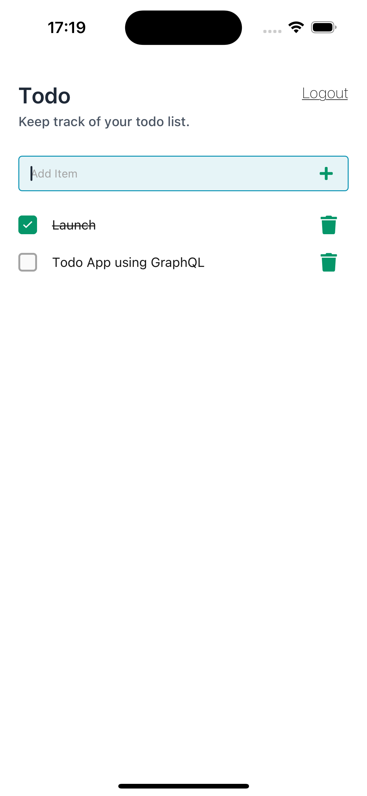

### Todo APP - Using Expo NativeBase Graphql Apollo 

### Installation

`yarn`

### Run Development IOS

`yarn ios`

### Run Development Android

`yarn android`

### Requirements

Node.js v16+
yarn
Expo CLI
Xcode
Iphone Simulator
Android Studio
Android Emulator
[React Native - Setting up the development environment](https://reactnative.dev/docs/environment-setup) 

## Project Requirements

We are deliberately keeping the requirements loose and defining the app as a “Todo List App.”

We leave it up to you to decide what features and functionality you’d like to include in your project, but it should be separated into two repositories (one for the frontend code and one for the backend code) and optionally a third repository (for infrastructure code).

However, you will not pass the technical evaluation if we can’t get your project running on our local machines based on the setup instructions in the READMEs explained below.

If you pass the technical evaluation, you will be asked to explain your code during your interview.

## Frontend

The following encompasses our tech stack for our frontend app:

- [Visual Studio Code](https://code.visualstudio.com/docs/introvideos/basics): IDE
- * [Git](https://git-scm.com/book/en/v2/Getting-Started-First-Time-Git-Setup): Source Control
- * [React](https://react.dev/learn): View Library
- * [React Native](https://reactnative.dev/docs/getting-started): View Library for Native apps
- * [Expo](https://docs.expo.dev/): React Native Framework
- * [Expo Router](https://expo.github.io/router/docs/): Routing Framework
- [Native Base](https://docs.nativebase.io/): Design Framework
- * [GraphQL](https://graphql.org/learn/): API Protocol
- * [Apollo](https://www.apollographql.com/docs/react): Client for interacting with the API
- [Reactive Variables](https://www.apollographql.com/docs/react/local-state/reactive-variables/): Apollo tool for managing local state
- [ECharts](https://echarts.apache.org/en/api.html#echarts): Library for charting results and data
- [Yup](https://github.com/jquense/yup): Library for form validation
- [React Hook Form](https://www.react-hook-form.com/): Library for building forms
- [luxon](https://moment.github.io/luxon/): Library for interacting with dates
- * [TypeScript](https://www.typescriptlang.org/docs/): Programming language
- [Cypress](https://docs.cypress.io/guides/overview/why-cypress): Testing Framework
- [GraphQL Gen](https://the-guild.dev/graphql/codegen): Tool for generating Type Definitions from GraphQL Schema and Operations
- [Debugging](https://docs.expo.dev/debugging/tools/)
- ESLint
- Prettier

Items marked with * are denoted as items that are required to be demonstrated in your Todo List app. All the rest are considered bonuses and will boost your overall evaluation score if included but are not mandatory.

Aside from the use of technologies and code quality, you must also include a README file in the repo that describes how to get the app and running on a local machine. You will be evaluated on the clearness, conciseness and completeness of the README.

## Backend

The following encompasses our tech stack for our backend:

- [Visual Studio Code](https://code.visualstudio.com/docs/introvideos/basics): IDE
- * [Git](https://git-scm.com/book/en/v2/Getting-Started-First-Time-Git-Setup): Source Control
- * [GraphQL](https://graphql.org/learn/): API Protocol
- * [Apollo](https://www.apollographql.com/docs/apollo-server/): open-source, spec-compliant GraphQL server that's compatible with any GraphQL client, including Apollo Client.
- * [TypeScript](https://www.typescriptlang.org/docs/): Programming language
- [Testing](https://docs.nestjs.com/fundamentals/testing)
- [Jest](https://jestjs.io/docs/getting-started): popular JavaScript testing framework developed by Facebook to help developers write and run tests for their code.
- * [NestJS](https://docs.nestjs.com/): framework for building efficient, scalable Node.js server-side applications. It uses progressive JavaScript, is built with and fully supports TypeScript (yet still enables developers to code in pure JavaScript) and combines elements of OOP (Object Oriented Programming), FP (Functional Programming), and FRP (Functional Reactive Programming).
- [RxJS](https://rxjs.dev/guide/overview): RxJS is a library for composing asynchronous and event-based programs by using observable sequences. It provides one core type, the Observable, satellite types (Observer, Schedulers, Subjects) and operators inspired by Array methods (map, filter, reduce, every, etc) to allow handling asynchronous events as collections.
- [ESLint](https://eslint.org/docs/latest/use/getting-started)
- [Prettier](https://prettier.io/)
- [Postgres](https://www.postgresql.org/docs/)

Items marked with * are denoted as items that are required to be demonstrated in your Todo List app. All the rest are considered bonuses and will boost your overall evaluation score if included but are not mandatory.

Aside from the use of technologies and code quality, you must also include a README file in the repo that describes how to get the app and running on a local machine. You will be evaluated on the clearness, conciseness and completeness of the README.

## Infrastructure

This repository is completely optional, but if included, will boost your overall evaluation score.

The following technologies are used to build the AWS infrastructure that powers our apps.

- [Visual Studio Code](https://code.visualstudio.com/docs/introvideos/basics): IDE
- [Git](https://git-scm.com/book/en/v2/Getting-Started-First-Time-Git-Setup): Source Control
- [TypeScript](https://www.typescriptlang.org/docs/): Programming language
- [CDK](https://docs.aws.amazon.com/cdk/v2/guide/home.html)
- [CDK Pipeline](https://docs.aws.amazon.com/cdk/v2/guide/cdk_pipeline.html)
- [CloudFormation](https://docs.aws.amazon.com/AWSCloudFormation/latest/UserGuide/GettingStarted.html)
- [ESLint](https://eslint.org/docs/latest/use/getting-started)
- [Prettier](https://prettier.io/)